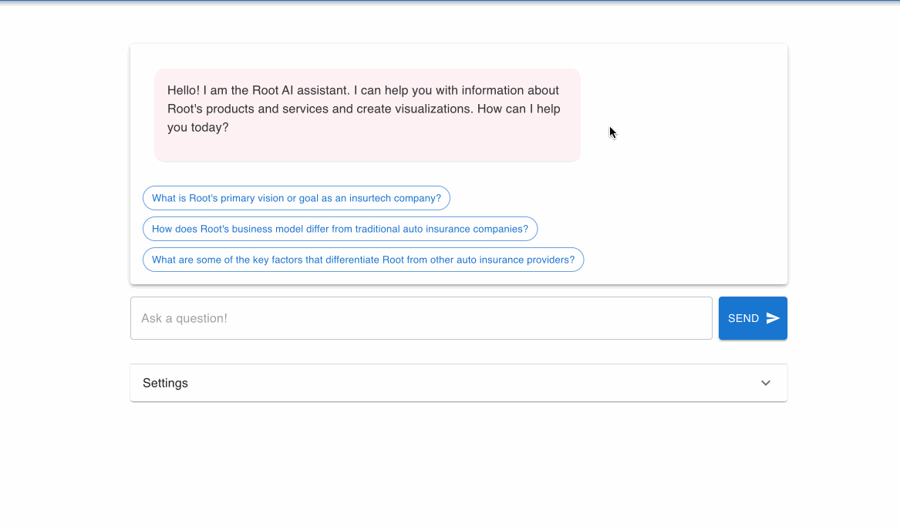
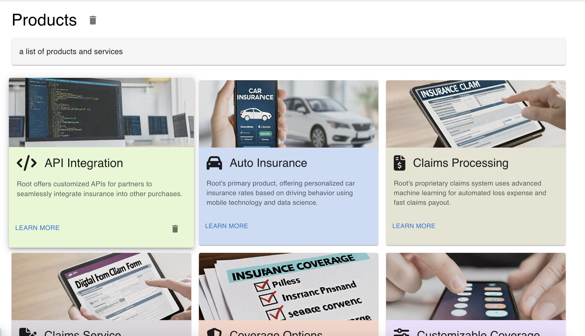
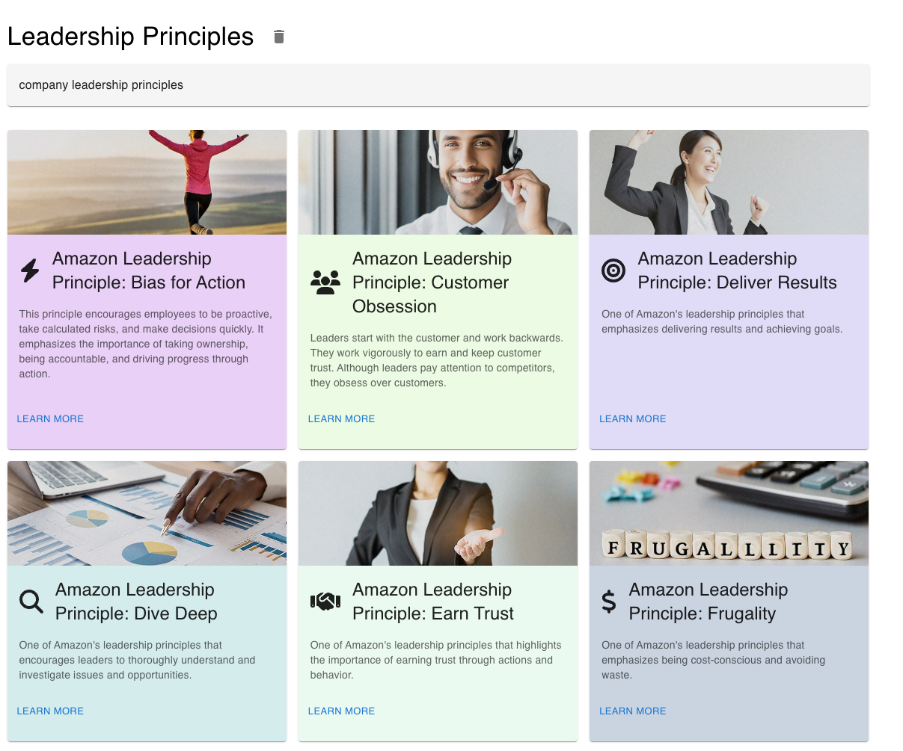
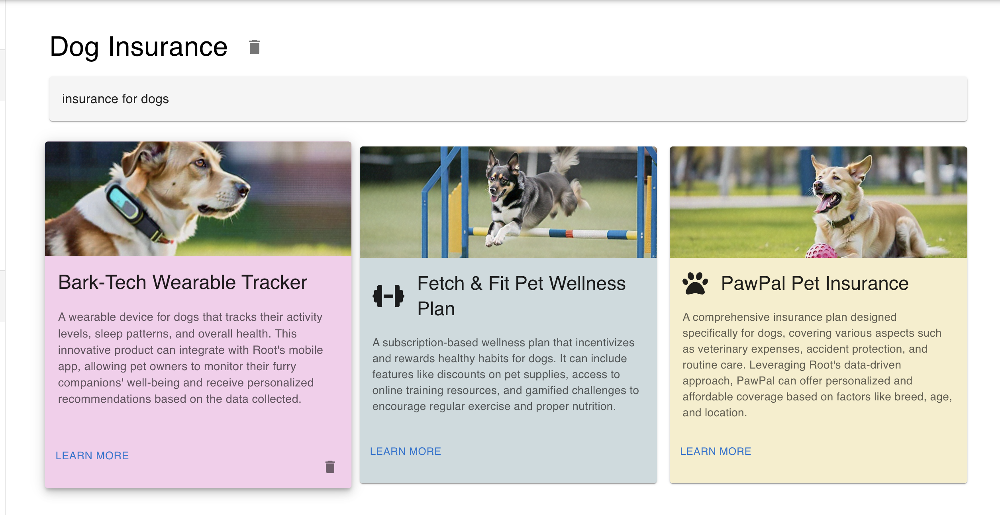

🆕 New: See the demo for yourself. Live demo link: https://d1ly1sce1no66z.cloudfront.net/

# AWS Bedrock WebInsights Demo
## About
The AWS Bedrock WebInsights demo is designed to introduce customers to the capabilities of Amazon Bedrock suite of services, including Bedrock Knowledge Bases and frontier models like Claude 3.

The demo can be customized to each customer and their industry, and consists of three main components: a Conversational AI Chat Demo, an Automated Product Catalog Generator and a Product Ideator.

Each part serves a distinct purpose, demonstrating practical applications of GenAI by utilizing real data from the customer's public-facing website. Deployed as an easily manageable CDK project, the demo experience emphasizes the real-world potential of GenAI in a way that resonates with the specific needs and context of the customer.

This tailored approach not only personalizes the experience but also highlights the transformative potential of GenAI, instilling confidence, curiosity, and recognition of the vast opportunities that Generative AI presents.

## Features
- **Conversational AI Chatbot**
  - A modern-looking chatbot written in ReactJS that understands and responds to queries about the website.
  - Real-time interaction using Generative AI models.
  - Seamless integration with the frontend for an engaging user experience.

   <details open>
    <summary>Screenshot</summary>

     
   </details>

- **Site Catalogs**
  - Automatically index and organize products and other types of data from the customer's website.
  - Generates detailed product descriptions.
  - Visual representation of products with autogenerated images.

   <details open>
     <summary>Screenshot</summary>
     
     
     
   </details>

- **Product Ideator**
  - Generate creative and unique product ideas for a customer based on their website and provided prompts.
  - Generate accompanying images for the products.
  - Automatically create a press release, social media post, and customer review preview for each product.

   <details open>
     <summary>Screenshot</summary>
     
     
     
   </details>

__Note: You must have access to a Bedrock enabled account to use this demo. You can also use the OpenAI API instead of Bedrock, but it's not advisable to demo in this way to customers.__


## Requirements
- A Bedrock enabled Isengard account
- AWS CDK installed locally
- Docker installed locally
- AWS CLI installed locally
- A CDK bootstrapped account (see instructions below)

## Deployment
__🆕 NEW! We now have a `start.py` script to help you deploy the project more easily.__

### Using start.py

1. Make sure you have Python 3 installed on your system.

2. The `start.py` script should already be executable. To deploy the project:

   On Unix-like systems (Linux, macOS):
   ```
   ./start.py deploy
   ```
   
   On Windows:
   ```
   python start.py deploy
   ```

   This will check for CDK CLI installation, ensure your `cdk.context.json` is properly configured, and then deploy the default stack.

3. If you want to deploy a specific stack, you can add the `--stack` flag:
   ```
   ./start.py deploy --stack <stack-name>
   ```

4. If you want to use a specific AWS profile, you can add the `--profile` flag:
   ```
   ./start.py deploy --profile your-profile-name
   ```

5. To synthesize the CloudFormation template without deploying, run:
   ```
   ./start.py synth
   ```

6. To destroy the stacks, run:
   ```
   ./start.py destroy
   ```
   Or to destroy all stacks:
   ```
   ./start.py destroy --all
   ```

The `start.py` script will guide you through setting up the `cdk.context.json` file if it's missing or incomplete.

### Manual CDK Deployment (Alternative Method)

If you prefer to use CDK directly, you can still follow these steps:

Run `npm install` to install the dependencies.

Copy `cdk.context.json.template` to `cdk.context.json` and fill in the values.

Set [up cdk](https://docs.aws.amazon.com/cdk/latest/guide/getting_started.html#getting_started_install) and [bootstrap your account](https://docs.aws.amazon.com/cdk/latest/guide/bootstrapping.html) if you haven't already.

Then run `cdk deploy --all` to deploy the project to your environment.

### Example Configuration for cdk.context.json
```
{
    "scrapeUrls": [
        "https://www.example.com/"
    ],
    "customerName": "ACME Corp",
    "customerIndustry": "Trucking"

}
```
The `scrapeUrls` array contains the URLs that will be scraped and indexed into Kendra. Typically this is the customer's website. 

`customerName` This is the name of the customer that will be displayed in the header of the Streamlit Chat UI.

`customerIndustry` The industry that the customer is in. Used for synthetic data generation

## Stack Description

### KBStack (br-kb-stack.ts)
This stack creates:
- An OpenSearch Serverless collection
- A Bedrock Knowledge Base
- A data source for the Knowledge Base
- An ingestion job to populate the Knowledge Base

### AppStack (app-stack.ts)
This stack creates:
- A VPC and ECS cluster for the backend service
- An Application Load Balanced Fargate Service for the backend
- An S3 bucket for the frontend static files
- A CloudFront distribution for content delivery
- DynamoDB tables for products and site info

## Local Development
The components in the AppStack (React frontend and Python Flask backend) can be run locally using Docker. You will still need to deploy the KBStack to provide a knowledge base for the backend to query.

To run the AppStack locally:

1. Add a `.env.local` file to the `/backend` directory with the following:
```
AWS_REGION=
CUSTOMER_NAME=
KNOWLEDGE_BASE_ID=
```

Then run `./start.py local` to start the frontend and backend locally. 
